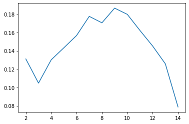
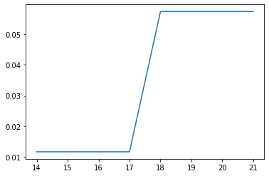

# MedTop
> Extracting topics from reflective medical writings


This file will become your README and also the index of your documentation.

## Install

`pip install medtop`

## How to use

Download NLTK data to your machine using `python -m nltk.downloader all`

Import documents from a text file containing a list of all documents

```python
path_to_file_list = 'data/2019.03.11_DevCorpus/file_list.txt'
my_docs, my_docs_pos, my_docs_loc, raw_sentences, raw_docs = import_docs(path_to_file_list, verbose=False)
```

You can review the imported documents manually by writing the sentences to disk

```python
outfile_name = 'output/PREFIX_DocumentSentenceList.txt'
sentences_to_disk(raw_sentences, outfile_name)
```

Create the TF-IDF matrix. `path_to_corpus_file_list` can be a list of just input files (Local) or a list of all files in the corpus (Global)

```python
path_to_seed_topics_file_list = 'data/2019.03.12_SEED_TOPICS/FILELIST.txt'
tfidf_dense, dictionary = create_tfidf(path_to_seed_topics_file_list, path_to_corpus_file_list = path_to_file_list, verbose = False)
```

Get the top phrases for each document.  
**TODO: This currently re-processes each sentence unnecessarily**

```python
doc_top_phrases = get_doc_top_phrases(raw_docs, dictionary.token2id, tfidf_dense, window_size = 6, include_input_in_tfidf = False)
```

Create sentence vectors. Multiple options are available:  
**TODO: add explanations**
- TF-IDF
- SVD
- UMAP
- Pre-trained Word2Vec embeddings
- Create Word2Vec embeddings from input corpus

```python
doc_phrase_vecs = get_doc_word_vectors_tfidf(doc_top_phrases, dictionary, tfidf_dense)
# doc_phrase_vecs = get_doc_word_vectors_svd(doc_top_phrases, dictionary, tfidf_dense)
# doc_phrase_vecs = get_doc_word_vectors_umap(doc_top_phrases, dictionary, tfidf_dense, umap_neighbors = 15, dimensions = 2)
# doc_phrase_vecs = get_doc_word_vectors_pretrained(doc_top_phrases, path_to_w2v_bin_file = "data/pubmed2018_w2v_200D.bin")
# doc_phrase_vecs = get_doc_word_vectors_local(doc_top_phrases, raw_docs, my_docs)
```

```python
doc_phrase_vecs = get_doc_word_vectors_local(doc_top_phrases, raw_docs, my_docs)
```

Filter the sentences, removing any that contain zero "top phrases"  

```python
total_phrase_num = sum([len(phrase_vecs) for phrase_vecs in doc_phrase_vecs])
just_phrase_vecs, just_phrase_ids, just_phrase_text = filter_sentences(doc_phrase_vecs, doc_top_phrases)
```

### Clustering

#### K-means Clustering
When using K-means clustering, you can find the optimal k value from a given range. `get_optimal_k` visualizes the silhoute coefficients for a range of k values and returns the value corresponding to the max silhoute coefficient.

```python
optimal_k = get_optimal_k(just_phrase_vecs, k_range = range(2, 15), save_chart = False)
cluster_assignments, dist = get_cluster_assignments_kmeans(optimal_k, just_phrase_vecs)
```





#### Hierarchical Agglomerative Clustering

```python
from sklearn.cluster import KMeans, AgglomerativeClustering
kclusters = KMeans(i).fit(just_phrase_vecs).predict(just_phrase_vecs)
print(kclusters)
silhouette_score(just_phrase_vecs, kclusters)
```

    [0 1 0 0 0 0 0 0 1 1 1 1 1 1 1 1 1]
    


    0.12031784


```python
i=13
hclusters = [x[0] for x in cut_tree(linkage_matrix, height=i)]
print(hclusters)
silhouette_score(just_phrase_vecs, hclusters)
```

    [0, 1, 2, 3, 4, 5, 6, 7, 8, 9, 10, 11, 12, 13, 14, 15, 16]
    


    ---------------------------------------------------------------------------

    ValueError                                Traceback (most recent call last)

    <ipython-input-85-44825ff7708c> in <module>
          2 hclusters = [x[0] for x in cut_tree(linkage_matrix, height=i)]
          3 print(hclusters)
    ----> 4 silhouette_score(just_phrase_vecs, hclusters)
    

    ~\Anaconda3\lib\site-packages\sklearn\metrics\cluster\_unsupervised.py in silhouette_score(X, labels, metric, sample_size, random_state, **kwds)
        115         else:
        116             X, labels = X[indices], labels[indices]
    --> 117     return np.mean(silhouette_samples(X, labels, metric=metric, **kwds))
        118 
        119 
    

    ~\Anaconda3\lib\site-packages\sklearn\metrics\cluster\_unsupervised.py in silhouette_samples(X, labels, metric, **kwds)
        226     n_samples = len(labels)
        227     label_freqs = np.bincount(labels)
    --> 228     check_number_of_labels(len(le.classes_), n_samples)
        229 
        230     kwds['metric'] = metric
    

    ~\Anaconda3\lib\site-packages\sklearn\metrics\cluster\_unsupervised.py in check_number_of_labels(n_labels, n_samples)
         33     if not 1 < n_labels < n_samples:
         34         raise ValueError("Number of labels is %d. Valid values are 2 "
    ---> 35                          "to n_samples - 1 (inclusive)" % n_labels)
         36 
         37 
    

    ValueError: Number of labels is 17. Valid values are 2 to n_samples - 1 (inclusive)


```python
dist_metric = "euclidean"
if dist_metric == "cosine":
    dist = 1 - cosine_similarity(just_phrase_vecs)
else:
    dist = pairwise_distances(just_phrase_vecs, metric=dist_metric)

linkage_matrix = ward(dist)
h_range = range(14, min(total_phrase_num, 100))
if dist_metric == "euclidean":
    h_score = [(silhouette_score(just_phrase_vecs, [x[0] for x in cut_tree(linkage_matrix, height=i)] )) for i in h_range]
else:
    h_score = [(silhouette_score(just_phrase_vecs, [x[0] for x in cut_tree(linkage_matrix, height=i)] )) for i in h_range]

fig = plt.plot(h_range, h_score)
```





```python
from sklearn.metrics import silhouette_score, pairwise_distances
from sklearn.metrics.pairwise import cosine_similarity
from scipy.cluster.hierarchy import ward, cut_tree
import matplotlib.pyplot as plt
# help(pairwise_distances)
```
